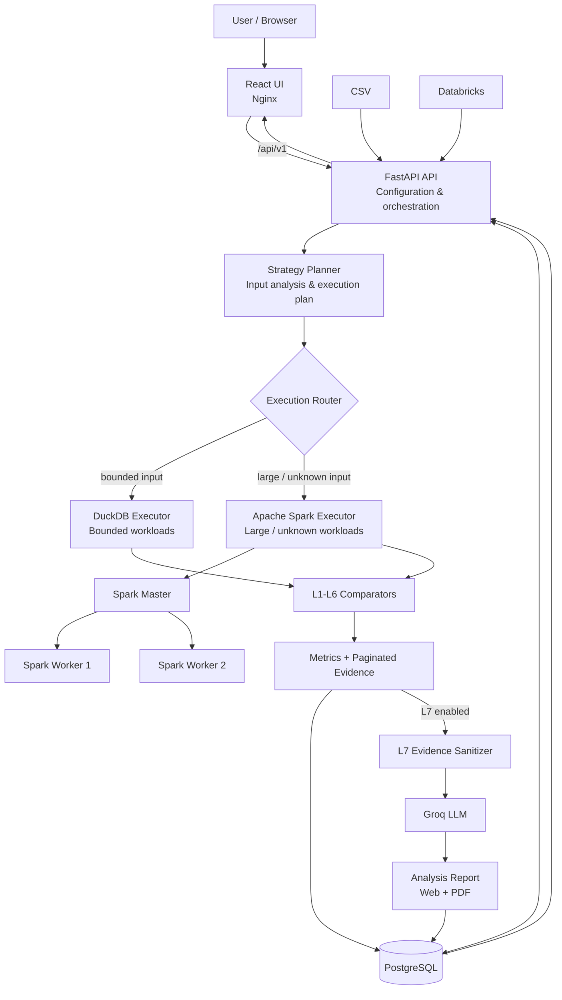

# Lumera — Intelligent Data Comparator

Lumera is a source-to-target data validation and reconciliation platform built to compare datasets from CSV and Databricks across schema, volume, records, fields, aggregates, and data-quality rules.

The project started as a simple comparator and evolved into a complete validation workflow with a React UI, FastAPI orchestration, PostgreSQL persistence, two execution engines (DuckDB and Apache Spark), and an optional privacy-safe LLM analysis layer.

It is intended for use cases such as ETL validation, migration testing, regression checks, release certification, source-to-target reconciliation, and data-quality investigation.

## What the platform supports

- CSV and Databricks source/target connections.
- Saved and reusable comparison configurations.
- Seven validation levels (L1-L6 deterministic validation + optional L7 analysis).
- Business-key based record matching.
- Duplicate, missing, extra, and unmatchable record detection.
- Column mapping when source and target names differ.
- Normalization such as trim whitespace, ignore case, empty string as null, and numeric rounding.
- Absolute and percentage tolerance for numeric comparisons.
- Source and target filters before row-based validation.
- Ignored columns for intentional source/target differences.
- Group-based reconciliation and aggregate comparison.
- Reusable aggregate and data-quality rules.
- Automatic execution routing between DuckDB and Spark.
- Paginated evidence instead of loading huge result sets into the browser.
- Validation score, data-match percentage, execution engine, status, and duration in results.
- Optional L7 plain-language analysis and PDF report using sanitized evidence only.
- Run history and cancellation support.

## Validation model

| Level | Validation | What it does |
| --- | --- | --- |
| **L1** | Schema | Compares columns, mapped names, types, lengths and nullability. |
| **L2** | Volume | Compares row counts, null counts and key-level statistics. |
| **L3** | Record Matching / Reconciliation | Finds matched, missing, extra, duplicate and unmatchable records using configured business keys. Group reconciliation is also supported when configured. |
| **L4** | Field Comparison | Compares fields for eligible matched records using mappings, normalization and numeric tolerance. Duplicate/ambiguous keys are not treated as clean one-to-one field matches. |
| **L5** | Aggregate | Runs configured aggregate validations and grouped aggregate comparisons with tolerance support. |
| **L6** | Data Quality | Applies configured completeness, validity/pattern and other supported DQ rules to source and/or target fields. |
| **L7** | Analysis | Converts the derived L1-L6 evidence into a privacy-safe plain-language report. |

L1-L6 are deterministic. L7 explains those deterministic results; it does not replace them or decide whether the underlying data passed validation.

## Result percentages

Lumera shows two different percentages because they answer different questions.

### Validation Score

The validation score represents validation-level health:

```text
Validation Score = passed deterministic levels / executed deterministic levels
```

For example, if only one of six executed deterministic levels passes, the validation score is `16.67%`.

### Data Match

Data Match represents similarity of the actual compared data, not the number of levels that passed. It combines record coverage from L3 with field conformity from L4 when both are available.

Conceptually:

```text
Record Match = matched records / max(source records, target records)
Field Match  = matched field values / compared field values
Data Match   = Record Match × Field Match × 100
```

This distinction is important for large datasets. A strict validation level may fail because of a small number of differences while the actual data can still be more than 99% matched. Lumera therefore keeps validation health and data similarity as separate metrics.

## Architecture



### How a comparison travels through the platform

1. The user selects source/target connections and validation levels in React.
2. The UI sends the comparison configuration to FastAPI through `/api/v1`.
3. FastAPI validates the configuration and the Strategy Planner analyzes the input metadata.
4. An execution plan is created for the selected validation levels.
5. The run is assigned to an execution engine. Bounded workloads can use DuckDB; large, unknown-size, or otherwise ineligible workloads remain on Spark.
6. The execution dispatcher sends tasks to the selected executor.
7. L1-L6 comparators produce deterministic metrics and bounded evidence.
8. Run state, results, evidence and configuration information are persisted in PostgreSQL.
9. The results API returns the consolidated result to the UI, including status, validation score, data-match percentage, execution engine and duration.
10. If L7 is enabled, sanitized derived evidence is sent to the configured Groq model and the generated analysis is stored and displayed as a web/PDF report.

## Execution engines

Lumera uses two engines because the same execution strategy is not ideal for every dataset size.

### DuckDB

DuckDB is used for bounded workloads where local, disk-backed analytical execution is more efficient than starting distributed Spark work. The configured defaults route eligible CSV workloads up to `1,000,000` rows per side and up to `1 GiB` combined input size to DuckDB. Databricks has its own bounded row threshold.

### Apache Spark

Spark handles large or unknown-size workloads. The Docker environment contains one Spark master and two workers. The backend acts as the Spark driver and submits work to the standalone Spark cluster.

The complete deterministic run stays on one selected engine so that the levels do not silently change execution semantics in the middle of a comparison.

## Record matching and reconciliation

The primary record-matching path uses explicit source-to-target business-key mappings. L3 separates records into meaningful categories such as matched, source-only/missing, target-only/extra, duplicate and unmatchable records.

Duplicate keys are important because a duplicated business key is not automatically a valid one-to-one match. L4 therefore uses a stricter eligibility rule: field comparison is performed on clean one-to-one matches instead of pretending ambiguous duplicate rows are equivalent.

Group reconciliation is available when row-level business-key comparison is not the right representation. Source and target grouping attributes can be mapped and configured aggregation columns can then be reconciled at group level.

## Field comparison

L4 supports source-to-target column mappings and configurable normalization. This is useful when the data is semantically equal but formatted differently.

Supported normalization/configuration includes:

- trim whitespace;
- case-insensitive comparison;
- empty string as null;
- numeric rounding where configured;
- absolute tolerance;
- percentage tolerance.

The result contains field comparison counts and bounded mismatch evidence rather than attempting to send every mismatch to the browser.

## Filters and ignored columns

Source and target filters are independent and are applied before row-based L2-L6 validation. Supported operators are:

```text
=  !=  >  >=  <  <=  IN  IS NULL  IS NOT NULL
```

All filters for one dataset are combined using `AND`.

Ignored columns are excluded from applicable comparison levels. If one side of a mapped source/target pair is ignored, the logical pair is excluded. Keys, grouping fields and aggregation fields cannot simultaneously be configured as ignored columns.

## L7 analysis and privacy

L7 is optional and requires `GROQ_API_KEY`.

The LLM is not the comparison engine. L1-L6 first calculate deterministic results. Before L7 is called, the application builds a sanitized evidence payload from those results. Raw client records, matched record pairs, business keys and raw field values are excluded from the LLM payload.

The L7 report provides a human-readable interpretation of the validation evidence and can be viewed in the UI or downloaded as PDF. Deterministic L1-L6 results remain the system of record.

## Technology stack

| Area | Technology |
| --- | --- |
| Frontend | React, Vite, Nginx |
| Backend/API | Python, FastAPI, Pydantic |
| Distributed execution | Apache Spark 3.5.3 / PySpark |
| Bounded analytical execution | DuckDB |
| Persistence | PostgreSQL 16, SQLAlchemy |
| LLM analysis | Groq API |
| Containers | Docker, Docker Compose |
| Data sources | CSV, Databricks |

## Docker deployment

The local Docker Compose stack contains:

```text
Browser
   |
   v
Frontend / Nginx :5173
   |
   v
FastAPI Backend :8000
   |---------------------- PostgreSQL :5432
   |
   +---- DuckDB (backend-local, disk backed)
   |
   +---- Spark Master :7077 / UI :8080
             |
             +---- Worker 1 / UI :8081
             |
             +---- Worker 2 / UI :8082
```

The bundled Spark workers are intentionally small for local development (`1 core`, `1 GB` each). Performance measurements from this setup should therefore be understood as local-machine results, not production cluster benchmarks.

### Start the complete platform

```bash
docker compose up --build -d
docker compose ps
```

Services:

| Service | Address |
| --- | --- |
| Lumera UI | `http://localhost:5173` |
| FastAPI | `http://localhost:8000` |
| API docs | `http://localhost:8000/docs` |
| Health | `http://localhost:8000/health` |
| Spark master UI | `http://localhost:8080` |
| Spark worker UIs | `http://localhost:8081`, `http://localhost:8082` |
| PostgreSQL | `localhost:5432` |

To stop the application without deleting PostgreSQL data:

```bash
docker compose down
```

Do not use `docker compose down -v` unless you intentionally want to delete the persisted volumes.

## Configuration

Create a `.env` in the repository root when environment overrides are required:

```dotenv
POSTGRES_PASSWORD=replace-me

# Optional L7
GROQ_API_KEY=
GROQ_MODEL=llama-3.3-70b-versatile

# Spark
SPARK_SQL_SHUFFLE_PARTITIONS=8
SPARK_EVIDENCE_LIMIT=100

# DuckDB routing
DUCKDB_EXECUTION_ENABLED=true
DUCKDB_MAX_ROWS=1000000
DUCKDB_MAX_INPUT_BYTES=1073741824
DUCKDB_DATABRICKS_MAX_ROWS=100000
DUCKDB_DATABRICKS_CHUNK_SIZE=1000
DUCKDB_THREADS=2
DUCKDB_MEMORY_LIMIT=2GB
```

Never commit `.env`, access tokens or passwords.

## Using Lumera

1. Open **Connection Manager** and create the source and target connections.
2. For CSV, upload/select a dataset. For Databricks, configure and test the connection and select the required catalog/schema/table.
3. Create or open a saved comparison configuration.
4. Select the validation levels required for the run.
5. Configure source/target filters and ignored columns if needed.
6. Configure the comparison/business key for record matching.
7. Configure group reconciliation when required.
8. Add column mappings, normalization and tolerance for field comparison.
9. Select or create aggregate and data-quality rules.
10. Review the configuration and start the comparison.
11. Monitor the run and inspect the level results and paginated evidence.
12. If L7 was selected, open the Analysis Report after deterministic validation finishes.

## API overview

All domain APIs use the `/api/v1` prefix.

| Method | Endpoint | Purpose |
| --- | --- | --- |
| `GET` | `/health` | Backend health check. |
| `POST` | `/api/v1/connections/upload-csv` | Upload a CSV file. |
| `POST` | `/api/v1/connections` | Create a connection. |
| `GET` | `/api/v1/connections` | List connections. |
| `POST` | `/api/v1/connections/schema` | Discover schema. |
| `POST` | `/api/v1/connections/discover/catalogs` | Discover Databricks catalogs. |
| `POST` | `/api/v1/connections/discover/schemas` | Discover Databricks schemas. |
| `POST` | `/api/v1/connections/discover/tables` | Discover Databricks tables. |
| `POST` | `/api/v1/configurations` | Save a comparison configuration. |
| `POST` | `/api/v1/comparisons` | Create and start a comparison. |
| `GET` | `/api/v1/comparisons` | List runs. |
| `GET` | `/api/v1/comparisons/{run_id}` | Read progress/status. |
| `GET` | `/api/v1/comparisons/{run_id}/results` | Read consolidated results. |
| `GET` | `/api/v1/comparisons/{run_id}/evidence/{level}` | Read paginated level evidence. |
| `POST` | `/api/v1/comparisons/{run_id}/cancel` | Cancel an active run. |
| `GET` | `/api/v1/comparisons/{run_id}/analysis/pdf` | Download L7 PDF. |
| `DELETE` | `/api/v1/comparisons/{run_id}` | Delete a saved run. |
| `POST/GET` | `/api/v1/rules` | Create/list reusable rules. |
| `PUT/DELETE` | `/api/v1/rules/{rule_id}` | Update/delete a rule. |

The interactive OpenAPI documentation at `/docs` is the best reference for the exact current request/response schemas.

## Project structure

```text
.
|-- app/
|   |-- analysis/          # L7 evidence shaping, prompts, Groq integration and report logic
|   |-- api/               # FastAPI application, routes and schemas
|   |-- comparators/       # Spark/DuckDB L1-L6 comparison implementations
|   |-- connectors/        # CSV, Databricks, filters and connector providers
|   |-- domain/            # Runtime configuration models
|   |-- execution/         # Dispatcher, Spark/DuckDB executors, workers and execution models
|   |-- persistence/       # PostgreSQL models and repository
|   `-- strategy/          # Input analysis and execution planning
|-- frontend/
|   |-- src/               # React application and result/report UI
|   |-- Dockerfile         # Frontend build
|   `-- nginx.conf         # Nginx SPA/API proxy and large-upload configuration
|-- Dockerfile             # Backend Spark/Python image
|-- docker-compose.yml     # PostgreSQL + Spark + backend + frontend stack
|-- requirements.txt
`-- README.md
```

Runtime CSV uploads are stored under `data/`, which is ignored by Git so large generated/uploaded datasets are not accidentally committed.

## Large-data testing

The Spark path has been tested locally with generated source and target CSV datasets containing intentional mismatches. Faker was used to generate the test data.

| Test | Approx. size | Observed local runtime |
| --- | --- | --- |
| 5 million rows | ~590 MB per source/target file | ~25 min first run; ~8 min second run |
| 12 million rows | >1 GB per source/target file | ~25 min first run; ~22 min second run |

Both test sizes completed successfully and the comparator identified the intentionally introduced differences. These are local-development observations, not formal performance guarantees. Runtime depends heavily on available CPU, memory, disk I/O, Spark worker resources, selected validation levels, rules, and the shape of the data.

The frontend Nginx configuration allows request bodies up to `2048m` so the local deployment can accept the larger CSV files used during this testing.

## Important implementation details

### CSV schema inference

CSV metadata inference is intentionally bounded rather than scanning the complete file just to discover types. For decimal columns, Spark uses a wide decimal precision while preserving the inferred scale. This prevents values later in a large CSV from becoming null simply because the initial schema sample contained only smaller numbers.

### Evidence limits and pagination

Comparisons may involve millions of records, but result evidence is deliberately bounded and paginated. Aggregate metrics describe the complete comparison while evidence gives inspectable examples without attempting to materialize the full mismatch population in the UI.

### Execution duration

Execution tasks record start time, finish time and duration. The result UI also uses persisted run timestamps when necessary to present the complete run duration.

## Operations and troubleshooting

Check containers:

```bash
docker compose ps
```

Follow backend logs:

```bash
docker logs -f v1-comparator-backend
```

Follow Spark workers:

```bash
docker logs -f v1-comparator-spark-worker-1
docker logs -f v1-comparator-spark-worker-2
```

Useful resource check during a large run:

```bash
docker stats --no-stream
free -h
df -h
```

Check active/recent comparison runs:

```bash
curl -s http://localhost:8000/api/v1/comparisons | jq
```

If a Spark job appears stuck, check the Spark master UI and worker logs before assuming the API process has failed. A browser/API timeout does not necessarily mean the underlying Spark work has stopped.

## Development verification

After code changes, useful basic checks are:

```bash
python -m compileall -q app

cd frontend
npm ci
npm run build
```

For a full smoke test, rebuild the Docker services, verify `/health`, and run a small source-to-target comparison before testing large datasets.

## License

This project is licensed under the Apache License 2.0. See [LICENSE](LICENSE) for details.
